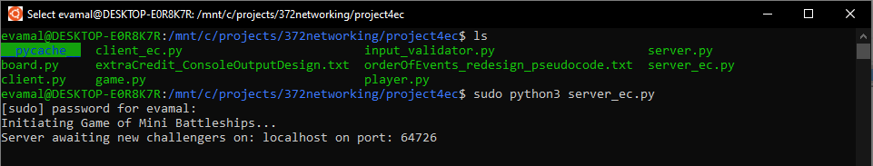
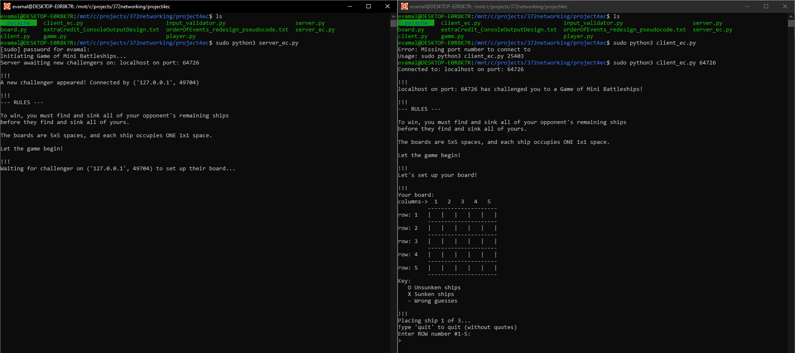
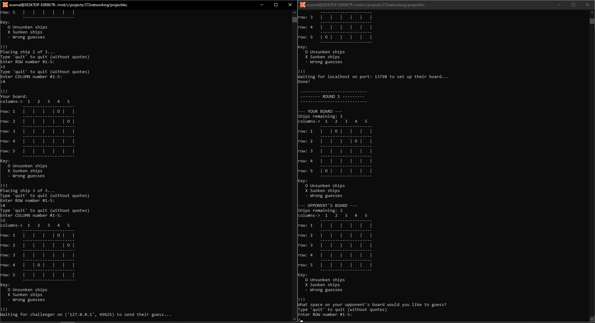
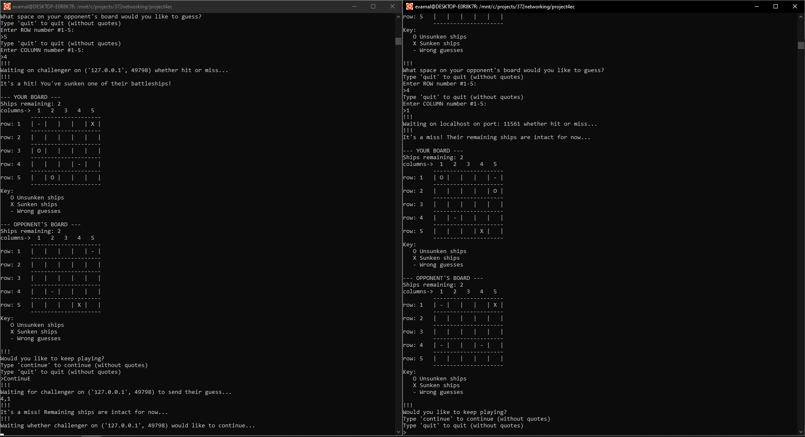
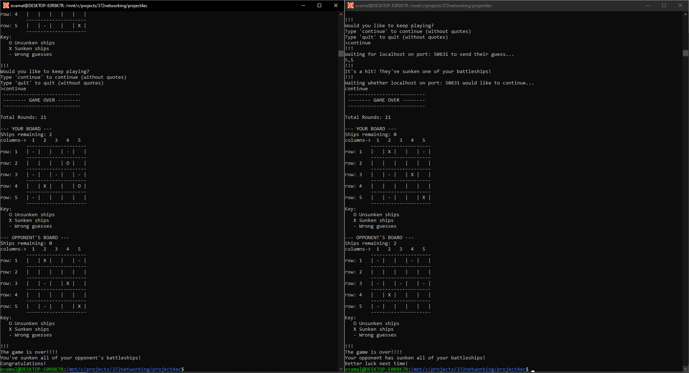
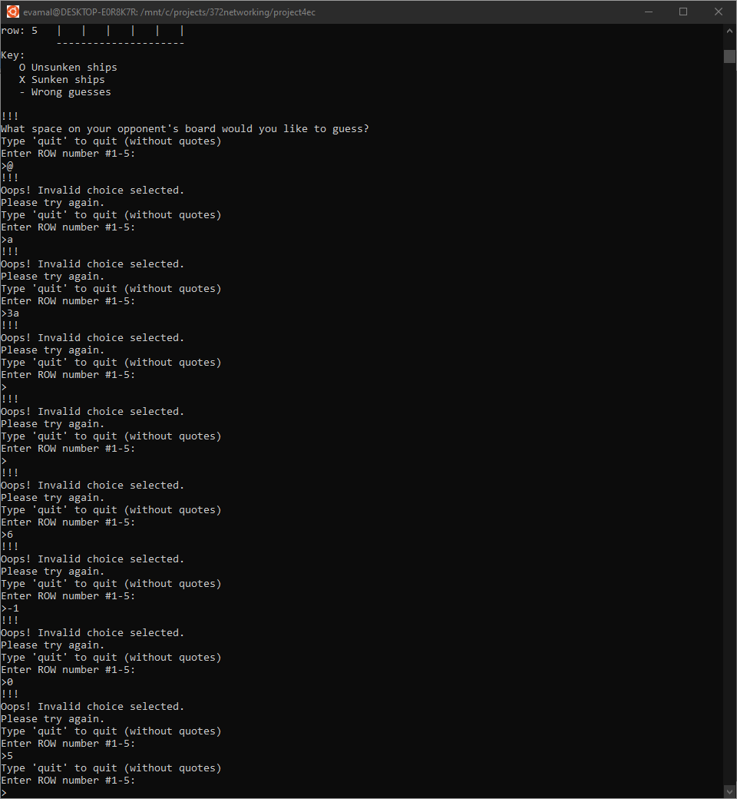
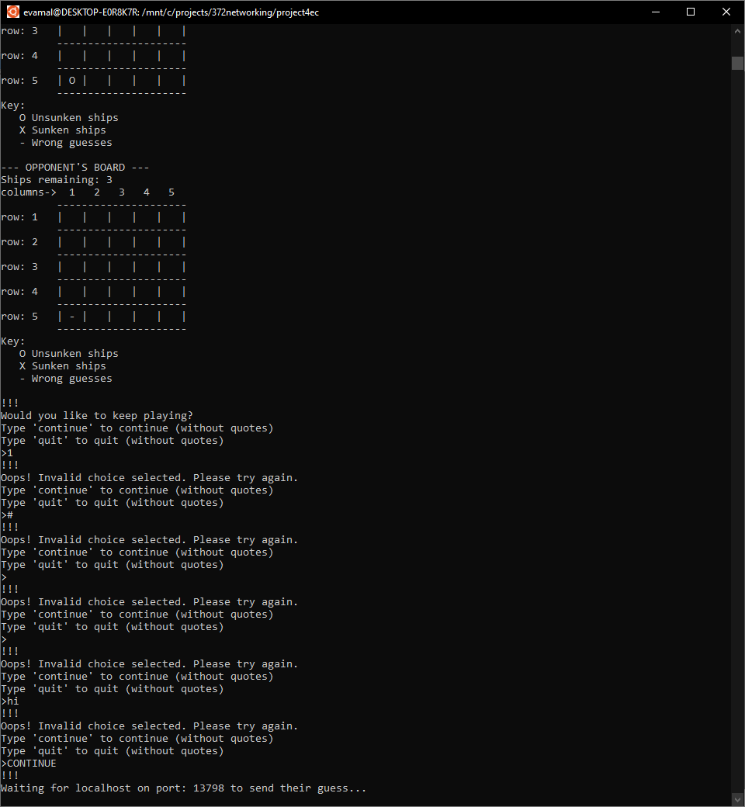
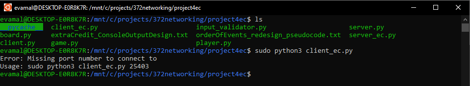

# Description:
This program utilizes a client-server socket connection to allow 2 players to play an ascii game of Mini* Battleships. 

**The game is considered "mini" in the sense that the board size, ship count, and ship sizes have been scaled down from the typical Battleship game (in my game, the board is only 5x5 squares, utilizes only 3 ships per player, and each ship only takes up one 1x1 space). If this project were to be expanded upon further, I would update it to utilize the full standard board size, ship count, and ship sizes/shapes of a typical Battleship game.*
# Files:
This programming project contains six (6) total source code files: 
* board.py
* client.py
* game.py
* input_validator.py
* player.py
* server.py

# How to run:

These instructions assume the users are running the code on a Linux environment and that Python3 is installed. The code in the screenshots below were run in Ubuntu on Windows 10 in administrator mode.
### To run:
1. Clone this repo and ensure you have Python3 installed, and are running it in a Linux environment.
2.	In an instance of a Linux command line, have player 1 navigate to the folder where the source files are located, and run the server program as follows to initiate a connection:
    * Enter ‘sudo python3 server.py‘. 
    * Enter your password if prompted, then hit enter to run the program.
3.	Note the randomly generated port number that the server will be listening on once run. It will be output to the console as such:
    * ‘Server listening on: localhost on port: **27339**’
4.	In a new instance of a Linux command line, have player 2 navigate to the folder where the source files are located, and run the client program as follows, supplying the earlier-noted port number as a command line argument:
    * Enter ‘sudo python3 client.py **27339**‘. 
    * Enter your password if prompted, then hit enter to run the program.
5.	The port number used when running the client program **must** match the port number output to the console after initiating the server program.
6.	Follow the rules and prompts output to the console during the program to play the game to completion, or to quit when prompted.

# Screenshots of running code
##### Screenshot 1. How to run Server program - server program after running and no connections made yet

##### Screenshot 2. How to run client program - client program (right) after connecting to server program (left). Server program auto-updates once connection is made.

##### Screenshot 3. Running code - Gameplay -  Board Setup Phase - Server program (left) and client program (right) after board setup phase (similar output whether server or client)

##### Screenshot 4. Running code - Gameplay - Guessing Phase - Server program (left) and client program (right) during back-and-forth guessing phase (similar output whether server or client)

##### Screenshot 5. Running code - Gameplay - Game Over - Server program (left) and client program (right) after game is over and one has won (similar output whether server or client)

##### Screenshot 6. Numeric input validation

##### Screenshot 7. Case-insensitive alpha input validation

##### Screenshot 8. Exception handling for missing command line argument in client program

# Comments/observations
The game I chose to utilize a client-server socket connection is a multiplayer (2-player) ascii game of Mini Battleships.

The game cycles through different 'game phases' to follow the socket connection flow established by a prompt for a server and client program. It cycles through the 'Setup' phase once, then the remaining game phases until someone wins.

I needed to add the question asking each user if they would like to continue the game after each makes a guess to maintain the wait-then-receive rhythm between server and client but may adjust in the future if I have some time.

